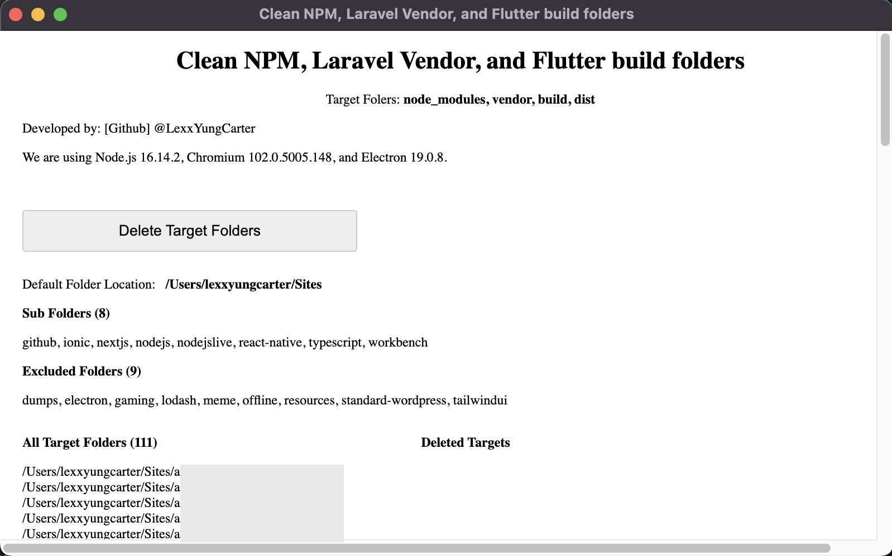

# NPM, Laravel, and Flutter Cleaner
A cleaner for getting rid of project development folders for laravel, node and flutter projects.



## Compiling
Compile via `electron-builer`

```bash
# run project
npm start

# build for all platfirms
electron-builder -mwl

# Build applications for macOS:
electron-builder --mac

# Build applications for Windows:
electron-builder --win

# Build applications for Linux:
electron-builder --linux
```

## Credit
- [Lexx YungCarter](https://github.com/lexxyungcarter)
- [Mail](mailto:lexxyungcarter@gmail.com)

## License
MIT
